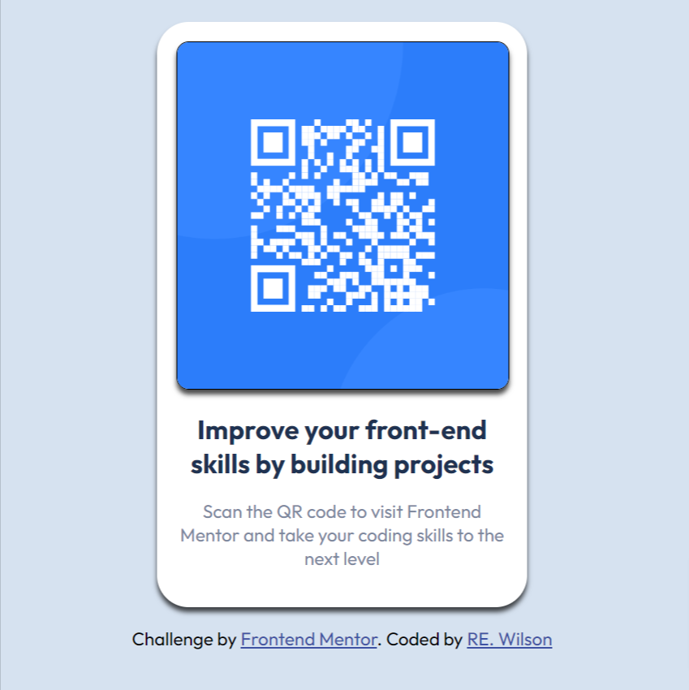

# Frontend Mentor - QR code component solution

This is a solution to the [QR code component challenge on Frontend Mentor](https://www.frontendmentor.io/challenges/qr-code-component-iux_sIO_H). Frontend Mentor challenges help you improve your coding skills by building realistic projects. 

## Table of contents

- [Overview](#overview)
  - [Screenshot](#screenshot)
  - [Links](#links)
- [My process](#my-process)
  - [Built with](#built-with)
  - [What I learned](#what-i-learned)
  - [Continued development](#continued-development)
  - [Useful resources](#useful-resources)
- [Author](#author)
- [Acknowledgments](#acknowledgments)

## Overview
This is my submission to the Front End Mentor Coding Challenge 

### Screenshot

### Links

- Solution URL: [Live Site](https://rw2023qrcode.netlify.app/)

## My process
Was very long and involved learning as I went. In the end the discovery of figma and becoming proficient in it's use was a big factor in the end result. 

### Built with

- Semantic HTML5 markup
- CSS custom properties
- Flexbox
- Mobile-first workflow

### What I learned

The biggest thing I learned from this process was the proper use of classes for targeting styling css. Another big lesson I learned was in utilizing the mobile first workflow to ensure responsiveness. 

### Continued development

The entire challenge has highlighted my need for continued practice with CSS and design principles.

### Useful resources

- [Figma ](https://www.figma.com/) - This helped a lot with visualizing the design. 

## Author

- Website - [RE. Wilson](https://rewlandingpage.netlify.app/)
- Frontend Mentor - [@RW2023](https://www.frontendmentor.io/profile/RW2023)

## Acknowledgments

I would like to acknowledge the team at FEC on discord for providing so much support and guidance throughout the process. 
